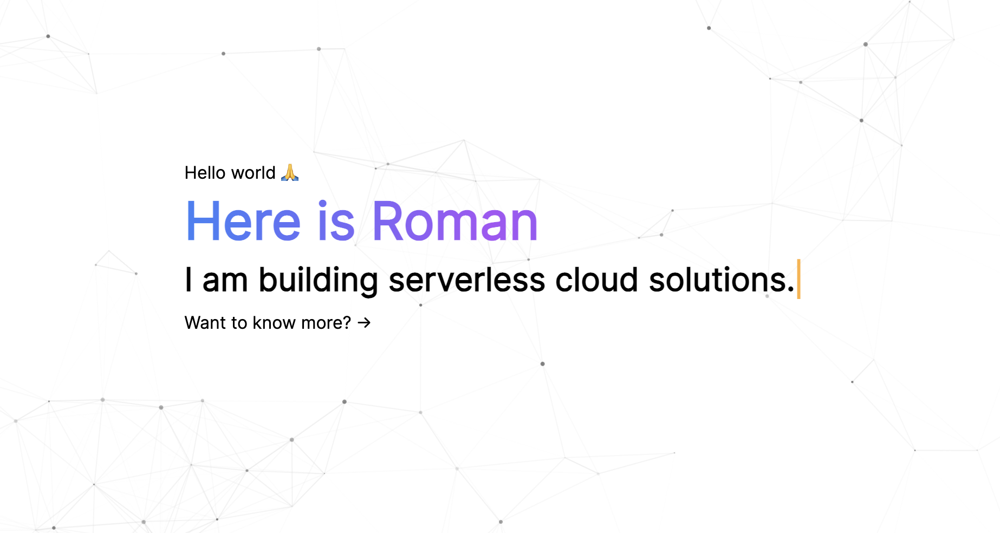

# My Personal Landing Page

[](https://stackblitz.com/github/romcok/my-astro-landing)
[](https://codesandbox.io/p/sandbox/github/romcok/my-astro-landing)


> Just rename and change `config.example.json` to get your personal landing page.

## 🔧 Configuration
```JSON
{
  "title": "Here is Roman",
  "description": "A Software Engineer and Entrepreneur.",
  "linkLabel": "Go to my resume",
  "linkUrl": "https://resume.romcok.com",
  "cloudflareToken": "",
  "githubRepository": ""
}
```

## 🚀 Example
View a example [here](https://romcok.com)


## 👷 Installation

Run the following command in your terminal ***(If you don't have pnpm use npm instead)***

```bash
pnpm install
```

Once the packages are installed you are ready to run astro. Astro comes with a built-in development server that has everything you need for project development. The astro dev command will start the local development server so that you can see your new website in action for the very first time.

```bash
pnpm dev
```

## 🚚 Deployment

## TODO
- Social networks

## 🧞 Commands

All commands are run from the root of the project, from a terminal:

| Command                | Action                                           |
| :--------------------- | :----------------------------------------------- |
| `npm install`          | Installs dependencies                            |
| `npm run dev`          | Starts local dev server at `localhost:3000`      |
| `npm run build`        | Build your production site to `./dist/`          |
| `npm run preview`      | Preview your build locally, before deploying     |
| `npm run astro ...`    | Run CLI commands like `astro add`, `astro check` |
| `npm run astro --help` | Get help using the Astro CLI                     |


## License
This module is released under the MIT License.